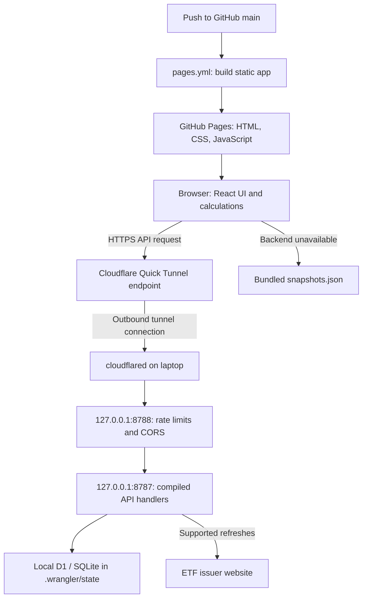
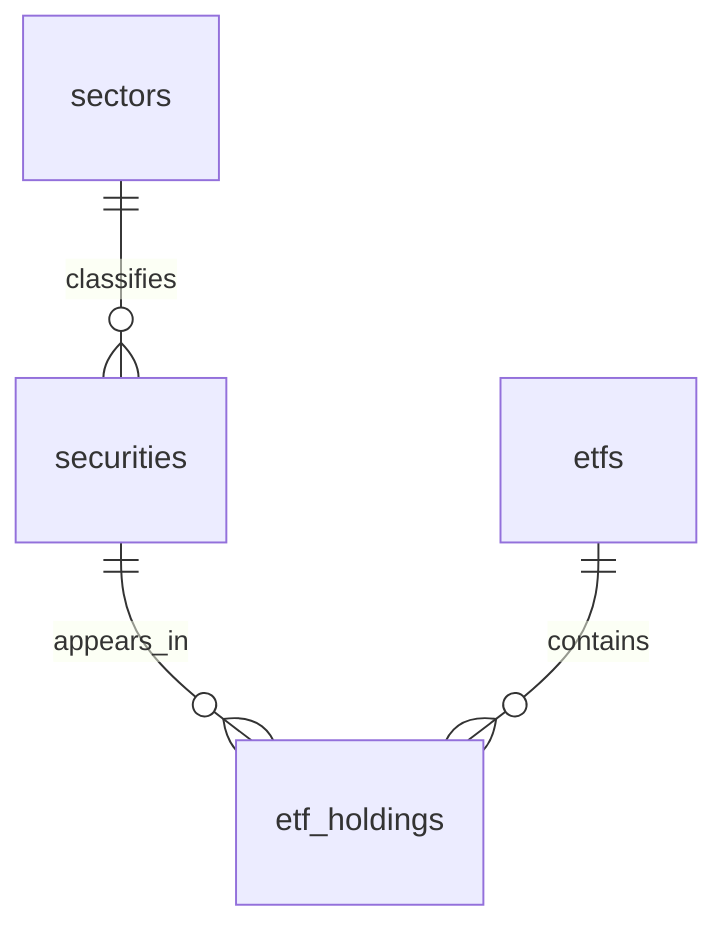

# Portfolio Lens: engineering guide

This document describes the deployed system as of 18 September 2026.

## Start here

- Public site: https://andrew-salib.github.io/portfolio-lens/
- Repository: https://github.com/andrew-salib/portfolio-lens
- Deployment branch: `main`.
- Front end: static React application on GitHub Pages.
- Backend: compiled Vinext Worker running through local Wrangler on Andrew's Mac.
- Data: local SQLite through Wrangler's emulated Cloudflare D1 binding.
- Public API connection: outbound Cloudflare Quick Tunnel to a protected gateway.

There are two builds of the same UI: the standalone GitHub Pages build and the
original full-stack Vinext build. GitHub Pages does **not** run API handlers or
store the database. The backend is not deployed to Cloudflare Workers in this
arrangement; Cloudflare provides the tunnel, while execution and storage stay
on the laptop. The older Sites configuration remains for the original deployment
path and local Worker bindings.

## Request flow



The browser downloads fund holdings and computes portfolio exposure locally.
The backend handles catalogue lookup, persistence and supported issuer refreshes.
CSV files are parsed in the browser and sent as JSON holdings to the API.

## Main files and directories

| Path                               | Responsibility                                                            |
| ---------------------------------- | ------------------------------------------------------------------------- |
| `app/page.tsx`                     | Main UI, portfolio state, search, CSV selection, asset weights and views. |
| `app/globals.css`                  | Shared styling, including charts and responsive layout.                   |
| `app/layout.tsx`                   | Layout and metadata for the Vinext build, not the Pages entry point.      |
| `frontend/index.html`              | Static host HTML, title and favicon.                                      |
| `frontend/main.tsx`                | Mounts the same `Home` component with React `createRoot`.                 |
| `lib/api.ts`                       | API URL selection, timeouts, offline notifications and sample fallback.   |
| `lib/portfolio.ts`                 | Types, supported fund definitions, CSV parser and `analyze()`.            |
| `lib/snapshots.json`               | Bundled ETF holdings, dates and sources; also used for database seeding.  |
| `components/sector-exposure.tsx`   | Sector/holding navigation, labels and chart data.                         |
| `lib/sector-pie-scene.ts`          | Lazy-loaded Three.js rendering, raycasting and transitions.               |
| `components/ui/`                   | Shared UI primitives.                                                     |
| `app/api/*/route.ts`               | Worker HTTP endpoints; never included as executable APIs on Pages.        |
| `db/index.ts`                      | Access to Worker `env.DB`.                                                |
| `db/schema.ts`                     | Drizzle schema and relationships.                                         |
| `db/etf-repository.ts`             | Read, search and upsert funds, securities and holdings.                   |
| `db/security-repository.ts`        | Direct-security lookup/search and built-in security seeding.              |
| `drizzle/`                         | Versioned SQL migrations; `drizzle.config.ts` configures generation.      |
| `vite.pages.config.ts`             | Standalone Vite build, base path and public API URL injection.            |
| `vite.config.ts`                   | Vinext, Sites integration and local Cloudflare bindings.                  |
| `.openai/hosting.json`             | Original Sites ID and logical `DB` binding; not GitHub deployment config. |
| `scripts/backend-gateway.mjs`      | Public API allowlist, CORS, persistent rate limits and proxy.             |
| `scripts/host-laptop.mjs`          | Starts backend, gateway, sleep inhibitor and tunnel; updates GitHub.      |
| `scripts/backend-gateway.test.mjs` | Gateway integration tests.                                                |
| `scripts/run-framework.mjs`        | Selects the project execution profile and runs Vinext.                    |
| `scripts/sites-env.mjs`            | Keeps Wrangler tool state local to this checkout.                         |
| `.github/workflows/pages.yml`      | Builds and publishes the static front end.                                |
| `.github/workflows/build.yml`      | Type checks, gateway tests and full-stack build.                          |
| `HOSTING.md`                       | Short operational runbook.                                                |

Generated/ignored directories:

- `dist-pages/`: static Pages artifact; safe to regenerate.
- `dist/`: compiled Worker, static assets and generated Wrangler configuration.
- `.wrangler/state/`: **persistent application database; do not delete casually**.
- `backend-data/`: rate-limit database, tunnel address and service logs.
- `.sites-runtime/` and `.vinext/`: local tooling state.

## Build and deployment semantics

### GitHub Pages

`pages.yml` runs on pushes to `main` and manual `workflow_dispatch` events. It:

1. Checks out source and selects Node 22.
2. Runs `npm run install:ci` using the lockfile.
3. Runs `npm run build:pages`, setting `PAGES_BASE_PATH` to the repository subpath
   and `API_URL` from the GitHub repository variable of the same name.
4. Uploads `dist-pages/` with `actions/upload-pages-artifact`.
5. Publishes through `actions/deploy-pages` into the `github-pages` environment.

The workflow has `contents: read`, `pages: write` and `id-token: write` permissions.
Pages must use GitHub Actions as its publishing source. Deployment concurrency
uses the `pages` group without cancelling a running deployment.

`vite.pages.config.ts` injects `API_URL` as `process.env.NEXT_PUBLIC_API_URL`
and marks this build with `NEXT_PUBLIC_STATIC_HOST=true`. These are compile-time
values visible in the browser bundle, **not secrets**. Changing the GitHub variable
alone does not update an already published bundle: rebuild the Pages workflow.

`build.yml` runs separately on pushes/PRs targeting `main` and manual dispatch.
It installs dependencies, runs TypeScript checks, tests the gateway and builds
the full-stack app. **Pages deployment currently does not wait for this workflow
to pass.** Add branch protection/required checks or a workflow dependency if
strict deployment gating is needed.

### Laptop backend

`npm run build` produces `dist/server/index.js` and
`dist/server/wrangler.json`. Do not hand-edit the generated Wrangler file.
Binding configuration originates in `vite.config.ts` and `.openai/hosting.json`.

`npm run backend:host` starts the supervisor in `scripts/host-laptop.mjs`:

1. Runs Wrangler against the compiled Worker with `--local`, port 8787 and
   `--persist-to .wrangler/state`.
2. Starts the gateway on port 8788 with Node's SQLite support enabled.
3. Starts macOS `caffeinate -i` to prevent idle sleep while the supervisor runs.
4. Waits for a successful local fund-search request.
5. Starts `cloudflared tunnel --no-autoupdate --url http://127.0.0.1:8788`.
6. Extracts the assigned HTTPS address from tunnel output and writes it to
   `backend-data/tunnel-url.txt`.
7. Uses the authenticated `gh` CLI to set repository variable `API_URL` and
   dispatch `pages.yml` on `main`.

The repository name is currently hard-coded in this supervisor. Update it when
forking. GitHub authentication must have access to repository variables and
workflow dispatch. If updating GitHub fails, the supervisor logs the failure;
it does not automatically retry that update within the same process.

The tunnel creates an outbound connection; no router port forwarding is needed.
Only the gateway is exposed. Both local listeners bind to `127.0.0.1`.
Quick Tunnel addresses change on restart and have no uptime guarantee. During
the resulting Pages rebuild, the old API address can be unreachable. Already-open
browser tabs retain their old bundle until reloaded. A named tunnel with a stable
hostname is the natural upgrade for long-term use.

### macOS service configuration

The installed launch agent is **outside Git**:
`~/Library/LaunchAgents/com.andrew.portfolio-lens.plist`.

Current machine-specific settings:

| Setting               | Value                                                       |
| --------------------- | ----------------------------------------------------------- |
| Label                 | `com.andrew.portfolio-lens`                                 |
| Executable            | `/opt/homebrew/bin/node`                                    |
| Argument              | `/Users/andrewsalib/portfolio-lens/scripts/host-laptop.mjs` |
| WorkingDirectory      | `/Users/andrewsalib/portfolio-lens`                         |
| RunAtLoad / KeepAlive | Both enabled                                                |
| ThrottleInterval      | 30 seconds                                                  |
| PATH                  | Includes `/opt/homebrew/bin` for `gh` and `cloudflared`     |
| StandardOutPath       | `backend-data/service.log` in this checkout                 |
| StandardErrorPath     | `backend-data/service-error.log` in this checkout           |

On another Mac, recreate the launch agent with that Mac's absolute paths and
user environment. It runs after login, not before a user session exists.
Sleep from closing the lid, shutdown or loss of connectivity still interrupts
the API. The supervisor stops sibling processes if a child exits; launchd then
restarts the supervisor.

## API contract and data flow

| Endpoint                                 | Behavior                                                                                           |
| ---------------------------------------- | -------------------------------------------------------------------------------------------------- |
| `GET /api/search?kind=fund&q=VGS`        | Searches stored ETFs and known fund definitions; at most eight results.                            |
| `GET /api/search?kind=security&q=NXT`    | Searches stored securities and seeded direct assets.                                               |
| `GET /api/holdings?ticker=VGS`           | Reads the stored fund; may seed a bundled snapshot when absent.                                    |
| `GET /api/holdings?ticker=IVV&refresh=1` | Attempts supported live issuer refresh, persists it, otherwise falls back to stored/snapshot data. |
| `POST /api/holdings`                     | Validates JSON fund data and upserts the shared ETF catalogue.                                     |
| `GET /api/securities?ticker=NXT&id=...`  | Resolves a direct asset; optional identity disambiguates matching tickers.                         |

An `Asset` contains ticker, name, type, portfolio weight, holdings, date, source
and status. A `Holding` contains ticker, name, sector, fund weight and optional
identity/industry. Weight values use percentage units: `25` means 25%, not 0.25.

CSV parsing is in `parseHoldings()` in `lib/portfolio.ts`. The POST handler checks
positive finite holding weights, a valid ticker/name, no more than 10,000 rows,
and a total weight no greater than 102%. Read the parser as well when changing
validation: the browser parser and server checks are separate layers.

Live refresh is implemented for configured iShares funds with product IDs/slugs.
Do not assume every ETF supports live refresh. Direct defaults (NXT, BTC, CASH
and PROPERTY) are seeded by `db/security-repository.ts`. No scheduled holdings
refresh job currently runs.

## Database model



- `sectors`: unique sector name and primary key.
- `securities`: unique `identity_key`, ticker, name, sector FK, optional ISIN,
  country and industry, and asset type. Ticker alone is not globally unique.
- `etfs`: unique ticker, issuer metadata, source URL, holdings date and sync date.
- `etf_holdings`: ETF/security foreign keys and a SQLite `REAL` weight; each
  ETF/security pair is unique. There is one shared holdings table, not a table
  per ETF.

`saveEtf()` upserts metadata, sectors and securities, then replaces the fund's
holdings. It stores the current snapshot, not historical versions. Its multiple
repository stages are not one encompassing transaction; consider failure
recovery when extending imports. Parameterized SQL is used for database values.

The data lives under `.wrangler/state/v3/d1/`, not in GitHub. Rate limiting uses
a **separate** SQLite file, `backend-data/rate-limits.sqlite`.
The user's current portfolio is React state; there are no user portfolio tables
or account-based portfolio persistence. Reloading starts the example portfolio.

## Calculation and chart semantics

The portfolio supports percentage entry and dollar-amount entry. Dollar values
are kept in an in-memory map by asset ticker in `app/page.tsx`; each weight is
`assetValue / totalEnteredValue * 100`. These derived weights feed the same
`analyze()` function used by percentage mode. Amounts survive holdings refreshes
within the session and are separate from the previously entered percentages.
Switching back restores those percentage inputs. Equal-weight mode is available
only during percentage entry. A zero total produces no calculated exposures.
Use current values in one currency: the app does not convert exchange rates or
fetch prices. The displayed dollar total is not a currency conversion.

`analyze()` in `lib/portfolio.ts` runs in the browser and is memoized by assets
and the equal-weight setting in `app/page.tsx`.

- Normally, exposure = portfolio weight × holding weight / 100.
- If portfolio weights exceed 100%, they are normalized by their total.
- Fund holdings totals above 100% are likewise normalized.
- Under-allocation and missing fund coverage become unmapped/unallocated exposure.
- Equal-weight mode assigns each listed asset the same portfolio share.
- Underlying positions are consolidated by identity, with ticker matching only
  where unambiguous. Each position retains its contributing assets in `via`.
- Sector totals sum those underlying exposures.
- Overlap is the total exposure to positions present through multiple assets;
  it is not just the amount above a single copy of each position.
- AI exposure uses the explicit `aiTickers` set. It is a theme that overlaps
  sectors, not an independent official sector classification.

Three.js loads when the chart enters the viewport. Animation frames run during
transitions/interactions, stop when settled, and pause off-screen or in hidden
tabs. Reduced-motion preferences are respected and device pixel ratio is capped.
Sector drilldown renders up to 14 holdings plus a clickable remainder slice to
bound mesh count. Labels show percentage of the whole portfolio; hover also
shows the percentage of the current view. Small positive values display
`<0.01%`; actual zero displays `0.00%`.

## Offline behavior

`lib/api.ts` wraps API calls with a five-second read timeout and a 30-second
write timeout. Missing static-host API configuration, network failures and 5xx
responses trigger fallback. Aborted searches are cancelled without fallback.
Responses such as 400, 404 and 429 retain their server status.

Fallback serves bundled fund snapshots and searches only known bundled funds.
Direct-security search returns no offline results; unavailable asset lookups
return 404. Offline uploads fail explicitly and are not queued. A custom
`portfolio-backend` event drives the UI's offline banner. There is no continuous
health polling; subsequent requests detect recovery. Samples are dated data,
not a live mirror or cache of arbitrary user imports.

## Gateway protections and limits

The gateway exposes only the three API paths above. Browser origins default to
`https://andrew-salib.github.io`; override with the `FRONTEND_ORIGIN` environment
variable on the gateway/supervisor. CORS origins contain no repository path.
OPTIONS preflights are handled locally.

| Protection                          | Current limit                |
| ----------------------------------- | ---------------------------- |
| API requests                        | 120 per client IP per minute |
| Imports + forced refreshes          | 3 per IP per 15 minutes      |
| Imports + forced refreshes, shared  | 20 per hour                  |
| Concurrent uploads                  | One                          |
| Upload body                         | 2 MB of JSON                 |
| Upstream timeout                    | 25 seconds                   |
| Incoming headers / request timeouts | 10 / 15 seconds              |

Fixed-window counters persist across process restarts. Rejected attempts count
against the budgets reached during evaluation. Limit responses use HTTP 429
and `Retry-After`; oversized uploads receive 413. IP limits share a budget among
users behind the same public IP.

The gateway trusts `CF-Connecting-IP` because only the Cloudflare tunnel should
reach its loopback listener. Missing IP headers share the `local` bucket.
Do not expose either local port through router forwarding or trust arbitrary
forwarded IP headers. Local development against the Worker bypasses the gateway.

CORS and rate limits are not authentication. Public imports can modify shared
ETF records, and direct-security seeding can also write during GET requests.
The import quota does not cover every possible database write. Before broader
public use, add authenticated import permissions and audit history. The current
GitHub Pages and laptop deployment does not authenticate visitors.

## Local development and contribution

Use Node >=22.13 and npm. Hosting scripts additionally require macOS, `gh`
authenticated to the repository, and `cloudflared` on PATH.

```sh
git clone https://github.com/andrew-salib/portfolio-lens.git
cd portfolio-lens
npm run install:ci
npm run build
```

For a **new empty local database**, apply these migrations once, in order:

```sh
node --import ./scripts/sites-env.mjs ./node_modules/wrangler/bin/wrangler.js \
  d1 execute DB --local --config dist/server/wrangler.json \
  --persist-to .wrangler/state --file drizzle/0000_rare_abomination.sql
node --import ./scripts/sites-env.mjs ./node_modules/wrangler/bin/wrangler.js \
  d1 execute DB --local --config dist/server/wrangler.json \
  --persist-to .wrangler/state --file drizzle/0001_sturdy_black_cat.sql
npm run dev
```

Use the development URL printed by Vinext. Preview ports are separate from 8787
and 8788. The production laptop database is shared with dev on the same checkout:
use a separate clone for destructive experiments. New databases seed fund
snapshots on lookup; they do not automatically contain every imported record
from Andrew's database.

To test the standalone front end locally, without starting a public tunnel:

```sh
npx vite --config vite.pages.config.ts
```

With no `API_URL`, that mode uses samples. Set `API_URL` to an available backend
at process launch to test online behavior; ensure its CORS origin matches your
local preview. To reproduce the Pages artifact:

```sh
PAGES_BASE_PATH=/portfolio-lens/ npm run build:pages
```

Before opening a PR:

Create a new branch for each feature and open a pull request for the owner's
review. Do not push feature changes directly to `main` or merge the PR without
an explicit request. This workflow is also recorded in `AGENTS.md`.

```sh
npx tsc --noEmit
npm run test:gateway
npm run build:pages
npm run build
```

Format changed source with Prettier and follow `AGENTS.md`: descriptive names,
readable lines, separated data/calculation/UI responsibilities and comments for
non-obvious behavior. Add API paths to the gateway allowlist when needed, update
offline behavior deliberately, and never put secrets into front-end variables.
Schema changes require `npm run db:generate`, SQL review and applying only new
migrations to the target local database. Generation does not apply migrations.

## Operations and troubleshooting

Front-end changes deploy after pushing to `main`. Backend changes require a
local build and restart; GitHub Actions does not pull or restart laptop code.

```sh
# Rebuild local backend, then restart the already-installed service.
npm run build
launchctl kickstart -k gui/$(id -u)/com.andrew.portfolio-lens

# Inspect service and logs.
launchctl print gui/$(id -u)/com.andrew.portfolio-lens
tail -n 50 backend-data/service.log
tail -n 50 backend-data/service-error.log
cat backend-data/tunnel-url.txt

# Inspect public deployment runs.
gh run list --repo andrew-salib/portfolio-lens

# Repair the Pages API address if automatic GitHub updating failed.
gh variable set API_URL --body "https://YOUR-CURRENT-TUNNEL.trycloudflare.com" \
  --repo andrew-salib/portfolio-lens
gh workflow run pages.yml --ref main --repo andrew-salib/portfolio-lens
```

To stop hosting, run `launchctl bootout gui/$(id -u)
~/Library/LaunchAgents/com.andrew.portfolio-lens.plist` as one shell command.
To re-enable it, use `launchctl bootstrap` with the same domain and plist path.
Do not also run `npm run backend:host` while the service owns ports 8787/8788.

| Symptom                               | First checks                                                                                                                    |
| ------------------------------------- | ------------------------------------------------------------------------------------------------------------------------------- |
| Offline banner                        | Laptop awake/network connected; service logs; current tunnel URL versus GitHub `API_URL`; reload after a successful deployment. |
| API works locally but not on Pages    | Tunnel health, allowed origin, stale compiled API URL, browser read timeout.                                                    |
| 429 on upload                         | Observe `Retry-After`; check per-IP and shared limits. Do not clear counters as routine recovery.                               |
| Missing tables / startup loop         | Apply missing local migrations and verify `.wrangler/state` path.                                                               |
| Changes visible locally but not live  | Front end needs a Pages deployment; backend needs a local rebuild/restart.                                                      |
| Data disappears after moving checkout | Restore the local database backup; Git does not contain live data.                                                              |

Back up `.wrangler/state/` and `backend-data/` with the service and any development
server stopped, including SQLite sidecar files. Restore to the same relative
locations before starting. No automated backup schedule or log rotation is
currently configured. Never commit those directories, credentials or `.env` files.
